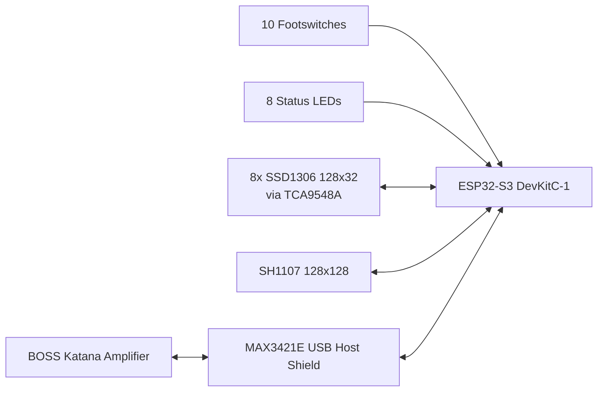

<div align="center">
  
  <h1>KatanaUSBH</h1>
  <p><strong>ESP32-S3 foot controller firmware for BOSS Katana amplifiers over USB MIDI SysEx.</strong></p>
  <p>
    
    
    
    
  </p>
</div>

KatanaUSBH turns an `ESP32-S3 DevKitC-1` into a dedicated Katana floor controller with per-switch OLED labels, a large preset display, status LEDs, and direct control of the amp through USB host MIDI.

## System Overview



## Features

- USB host connection to the Katana through the `USB-Host-Shield-20` library
- Automatic editor-mode enable when the amp connects
- Startup scan of all 8 Katana channels to cache preset names and effect states
- Eight dedicated OLED labels for the effect buttons
- One 128x128 main display for preset number and preset name
- Eight status LEDs that mirror the current effect states
- Fast local UI response with delayed preset transmission for smoother navigation
- Background resync after preset changes
- Clean disconnect handling with display reset to `No USB`

## What This Controller Can Do

### Katana Functions

| Control | Katana action | Notes |
| --- | --- | --- |
| `SOLO` | Toggle solo | LED reflects state |
| `FX` | Toggle FX block | Cached per preset |
| `REVERB` | Toggle reverb | Cached per preset |
| `MUTE` | Toggle mute | Implemented through the Katana foot volume/tuner SysEx address |
| `BOOST` | Toggle booster | Cached per preset |
| `MOD` | Toggle modulation | Cached per preset |
| `DELAY` | Toggle delay | Cached per preset |
| `DELAY-2` | Toggle delay 2 | Cached per preset |
| `Preset Up` | Move to next channel | Wraps from `8` back to `1` |
| `Preset Down` | Move to previous channel | Wraps from `1` back to `8` |

### Controller Functions

- Read and cache Katana channel names on startup
- Show the active preset name and number on the main display
- Show fixed labels above every effect footswitch
- Resync effect state after a preset change
- Keep the UI usable even while the amp is still loading the next preset

## Required Hardware

- `ESP32-S3 DevKitC-1`
- `MAX3421E` USB Host Shield or compatible USB host board
- `8x SSD1306 128x32` OLED displays
- `1x SH1107 128x128` OLED display
- `1x TCA9548A` I2C multiplexer
- `10x` momentary footswitches
- `8x` status LEDs with proper current limiting / driver circuitry
- USB cable from the host shield to the BOSS Katana amplifier

> [!IMPORTANT]
> This project requires a `MAX3421E` USB Host Shield. The firmware uses `usbhub.h` and `usbh_midi.h` from `USB-Host-Shield-20`; it does not use the ESP32-S3 native USB host stack.

## Wiring Supported By This Firmware

### USB Host Shield Wiring

The `USB-Host-Shield-20` library maps ESP32 boards to the following host-shield pins:

| ESP32-S3 GPIO | Connects to USB Host Shield |
| --- | --- |
| `18` | `SCK` |
| `19` | `MISO` |
| `23` | `MOSI` |
| `5` | `SS / CS` |
| `17` | `INT` |
| `GND` | `GND` |
| Shield power | Match your MAX3421E board requirements and keep logic levels ESP32-safe |

> [!NOTE]
> If your MAX3421E board is wired to different pins, the firmware will not work as-is. Rewire it to match this mapping or modify the USB Host Shield library configuration.

### Display Wiring

#### TCA9548A + SSD1306 button displays

| Signal | ESP32-S3 GPIO / Value |
| --- | --- |
| `Wire SDA` | `8` |
| `Wire SCL` | `9` |
| `TCA9548A address` | `0x70` |
| `SSD1306 address` | `0x3C` |

Use TCA channels `0-7` for the eight small displays.

| TCA channel | OLED label |
| --- | --- |
| `0` | `SOLO` |
| `1` | `FX` |
| `2` | `REVERB` |
| `3` | `MUTE` |
| `4` | `BOOST` |
| `5` | `MOD` |
| `6` | `DELAY` |
| `7` | `DELAY-2` |

#### SH1107 main display

| Signal | ESP32-S3 GPIO / Value |
| --- | --- |
| `Wire1 SDA` | `16` |
| `Wire1 SCL` | `15` |
| `Display address` | `0x3C` |

### Buttons And LEDs

Buttons are configured as `INPUT_PULLUP`, so each footswitch should connect between the listed GPIO and `GND`.

| Control | Button GPIO | LED GPIO |
| --- | --- | --- |
| `SOLO` | `14` | `48` |
| `FX` | `46` | `47` |
| `REVERB` | `41` | `21` |
| `MUTE` | `39` | `42` |
| `BOOST` | `6` | `45` |
| `MOD` | `10` | `35` |
| `DELAY` | `4` | `36` |
| `DELAY-2` | `40` | `37` |
| `Preset Up` | `38` | `-` |
| `Preset Down` | `7` | `-` |

LED outputs are driven active-high in firmware.

## Build And Flash

### Prerequisites

1. Install `PlatformIO`.
2. Connect the `ESP32-S3 DevKitC-1` to your computer.
3. Wire the hardware exactly as listed above.
4. Connect the Katana to the `MAX3421E` USB Host Shield.

### Build

```sh
pio run -e esp32-s3-devkitc-1
```

### Flash

```sh
pio run -e esp32-s3-devkitc-1 -t upload
```

### Serial Monitor

```sh
pio device monitor -b 115200
```

### PlatformIO Notes

- The project target is `esp32-s3-devkitc-1`
- The framework is `arduino`
- `platformio.ini` currently sets `[platformio] core_dir = c:/dev/pio`
- If your PlatformIO core lives somewhere else, update or remove that `core_dir` entry before building

## Startup Sequence

When the Katana is connected, the firmware currently:

1. Detects the amp over USB host MIDI.
2. Sends Katana editor mode twice.
3. Scans channels `1-8` to cache preset names and effect states.
4. Returns to preset `1`.
5. Requests current volume state.
6. Updates the LEDs and OLEDs with the cached data.
7. Forces the `MUTE` status active during startup handling.

If the amp disconnects, the controller clears the small OLEDs and shows `No USB` on the main display.

## Source Layout

- `src/main.cpp` - runtime flow, USB connect/disconnect, preset queueing, background sync
- `src/KatanaLogic.h` - Katana SysEx protocol, name cache, effect cache, MIDI parsing
- `src/oledControl.h` - SSD1306 label rendering and SH1107 main display rendering
- `src/buttonController.h` - button scan, debounce, LED control
- `src/ButtonConfig.h` - current button and LED pin mapping
- `src/OledConfig.h` - current I2C and display mapping

## Verification

This project does not currently include a dedicated automated test suite. The main verification step is a PlatformIO build for `esp32-s3-devkitc-1`.
